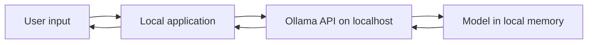
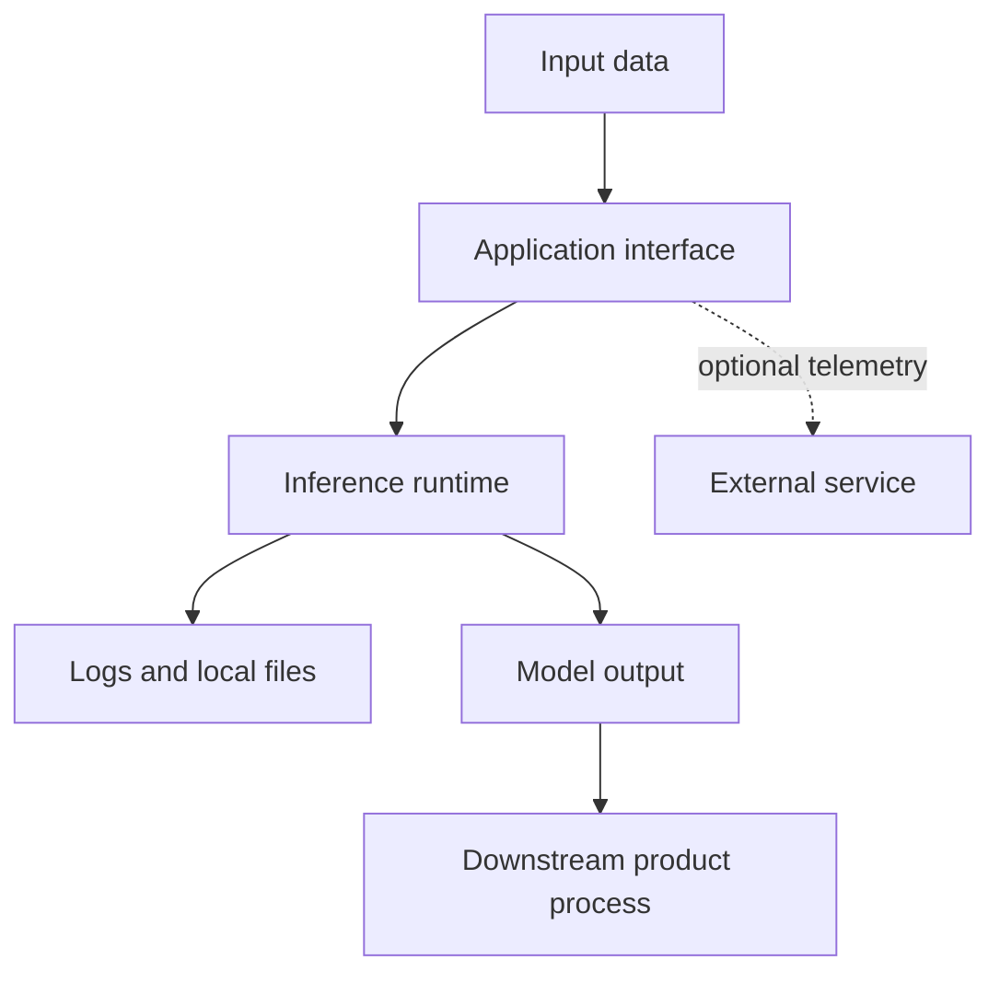
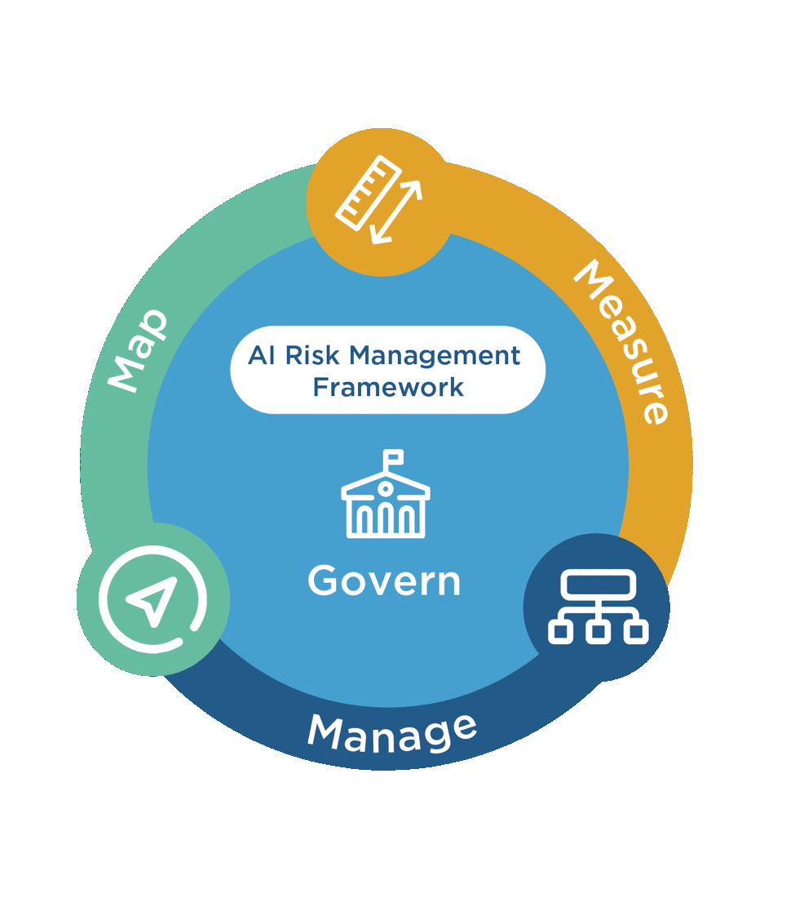

# Local LLM Foundations

## What "Local" Means

A local language model runs inference on hardware controlled by the user or
organization instead of sending each prompt to a hosted model API. Three parts
remain distinct:

1. **Model weights** contain learned parameters.
2. **Inference runtime** loads those weights and computes responses.
3. **Application** collects input, calls the runtime, and uses the output.

In this repository, Qwen3.5 2B provides the model weights, Ollama provides the
runtime and HTTP API, and the Python script or notebook acts as the application.

With a cloud API, the application instead sends input across a network boundary
to infrastructure operated by a provider. Neither architecture is universally
better; each changes the risks, capabilities, and operating responsibilities.

## Local and Cloud Trade-offs

| Dimension | Local inference | Hosted cloud inference |
|---|---|---|
| Data boundary | Prompts can remain on controlled hardware | Prompts are sent to a provider under its terms and controls |
| Capability | Limited by models and hardware that fit locally | Access to larger and frequently updated models |
| Availability | Can work without internet after setup | Depends on network and provider availability |
| Cost | Hardware, electricity, maintenance, and staff time | Usage fees, subscriptions, and integration costs |
| Scaling | Each device or server has finite capacity | Provider can usually offer elastic capacity |
| Control | More control over model version and runtime | Provider controls much of the infrastructure and release cycle |
| Operations | The organization owns updates, monitoring, and recovery | Provider handles much of the model-serving platform |

### Privacy Is an Architecture Property, Not a Label

Running a model locally can reduce data disclosure, but it does not
automatically make a product private or compliant. Data may still leave the
machine through analytics, cloud storage, browser extensions, application logs,
backups, or other connected tools. Local prompts and outputs may also remain on
disk where other users or processes can access them.

Before using sensitive data, map the complete flow:

Ask where data is processed, stored, logged, backed up, and deleted. Review the
entire application and its integrations, not only the model endpoint.

## Parameters, Precision, and Quantization

A parameter is a learned numerical value in a model. More parameters often
increase capability, but architecture, training data, alignment, and the task
also matter. Parameter count is not a quality score.

Model weights can be stored at different numerical precision. **Quantization**
uses fewer bits for many values, reducing storage and memory requirements. This
can make a model practical on consumer hardware, with possible trade-offs in
quality, speed, or compatibility.

The model file size is not the complete memory requirement. Inference also uses
memory for the runtime, temporary calculations, and the growing context cache.
Long prompts and larger context settings can therefore require substantially
more memory than the downloaded file alone.

## Product Decision Questions

Evaluate a deployment option against a concrete use case:

- What data enters the system, and what is its sensitivity?
- What quality threshold must the model meet on representative tasks?
- What response time and concurrency does the experience require?
- Must the product work offline or in a restricted environment?
- Which hardware is available to the intended users?
- Who will update models, investigate failures, and support users?
- What happens when the model produces unsafe, incorrect, or malformed output?
- Would a hybrid design provide a better balance?

*The NIST AI RMF organizes risk work around Govern, Map, Measure, and Manage.
Use these functions iteratively: establish ownership, map the use case and its
context, measure evidence against defined criteria, and manage the resulting
risks. Source: [NIST AI Risk Management Framework](https://www.nist.gov/itl/ai-risk-management-framework).*

Local inference is especially credible when data control, offline operation, or
predictable low-volume usage matters and a compact model meets the task. Cloud
inference may fit better when the product requires stronger capability, rapid
scaling, managed operations, or broad device support.

## Environmental Impact Needs Measurement

Both local and hosted inference consume electricity and depend on manufactured
hardware. A compact local model may use fewer resources per request than a much
larger hosted model, but local execution is not automatically more sustainable.
Low hardware utilization, inefficient devices, repeated experiments, model
downloads, and shortened hardware life can change the comparison. Cloud systems
also vary by model, accelerator, location, cooling, energy mix, and utilization.

Compare credible alternatives for the same task. Record the model and hardware,
measure representative usage where possible, include embodied hardware and
operating life in the decision, and avoid universal claims from one laptop run.

## Check Your Understanding

1. Why does a local model not automatically guarantee privacy?
2. Why is model file size lower than the full memory requirement?
3. What evidence is needed before choosing local inference for a product?

Show solution

1. The application may still use telemetry, logs, backups, extensions, or
   downstream services that expose data.
2. The runtime also needs working memory and a context cache, which can grow
   with prompt length.
3. The decision needs representative quality results, performance measurements,
   hardware constraints, data-flow analysis, operating costs, and product
   requirements.

## References

- [Ollama Documentation](https://docs.ollama.com/)
- [Ollama FAQ: Context Length and Memory](https://docs.ollama.com/faq)
- [NIST AI Risk Management Framework](https://www.nist.gov/itl/ai-risk-management-framework)
