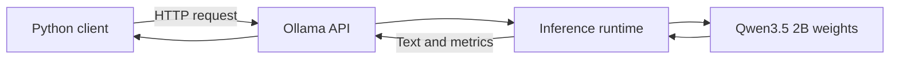
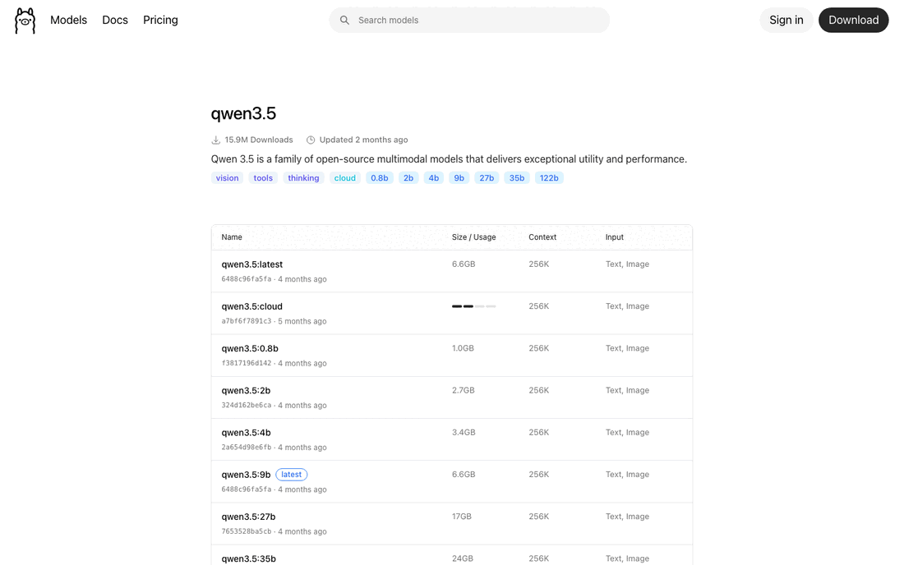
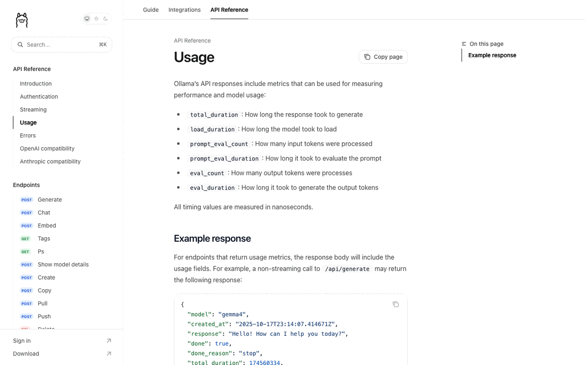

# Running Local Models with Ollama

## Ollama's Role

Ollama downloads model artifacts, loads them into memory, exposes a local API,
and returns generated output with usage metadata. It is an inference runtime,
not the product interface or the model itself.



By default, the local API is available at `http://localhost:11434`. `localhost`
means the same computer as the client. Exposing the service to other machines
changes the security boundary and requires deliberate network controls.

## Choose a Model Variant Deliberately

An Ollama model tag identifies a specific variant. `qwen3.5:2b` selects the 2B
variant rather than an unspecified default. Tags may also encode quantization or
runtime format.



*The official Ollama library lists multiple Qwen3.5 variants with different
sizes. The course uses `qwen3.5:2b`, listed as 2.7 GB at the time of capture.
Source: [Ollama Qwen3.5 tags](https://ollama.com/library/qwen3.5/tags).*

The advertised context window is a model capability limit, not a promise that
the full context will run comfortably on every laptop. Larger contexts consume
more memory and processing time. Start with the default configuration and
increase context only when the use case and measurements justify it.

## From Prompt to API Request

The `/api/generate` endpoint accepts a JSON request. A minimal non-streaming
request contains:

```json
{
  "model": "qwen3.5:2b",
  "prompt": "Explain this product risk in plain language.",
  "stream": false,
  "think": false,
  "options": {
    "num_predict": 256
  }
}
```

`stream: false` returns one complete JSON response. Streaming returns partial
events as tokens are generated and supports experiences that display output
progressively.

Qwen3.5 supports a separate reasoning mode. It can be useful for harder tasks,
but it increases the wait before a short answer and changes the response
contract. The introductory examples therefore set `think: false`. They also
set `num_predict` to bound the maximum generated tokens. These are deliberate
defaults for a predictable exercise, not universal production settings. See
the Ollama documentation for [thinking](https://docs.ollama.com/capabilities/thinking)
and [generation parameters](https://docs.ollama.com/modelfile#valid-parameters-and-values).

Applications should set a timeout, handle connection and server errors, and
validate the response before using it. A successful HTTP request does not prove
that the generated content is correct or suitable.

## Read the Operational Metrics Correctly



*Ollama reports durations and token counts in its API response. Timing values
are measured in nanoseconds. Source: [Ollama API usage documentation](https://docs.ollama.com/api/usage).*

Important fields include:

| Field | Product interpretation |
|---|---|
| `total_duration` | End-to-end generation time reported by Ollama |
| `load_duration` | Time spent loading the model before inference |
| `prompt_eval_count` | Number of input tokens processed |
| `prompt_eval_duration` | Time spent processing the prompt |
| `eval_count` | Number of output tokens generated |
| `eval_duration` | Time spent generating output tokens |

Generation throughput is:

```text
output tokens per second = eval_count / eval_duration in seconds
```

This is not the same as **time to first token**. A non-streaming request returns
only after generation finishes, so it cannot directly measure when the first
visible token arrived. Measuring time to first token requires a streaming
request and a timer stopped at the first content event.

Run more than one request. The first request may include model-loading cost,
while later requests can reuse a warm model. Record both cold and warm behavior
because users may experience either.

## Parameters Change Behavior, Not Truth

`temperature` influences sampling variability. Lower values often produce more
consistent output; higher values can increase variation. Temperature does not
make a model factual, and `0` does not guarantee identical results across every
runtime, model version, or hardware configuration.

For a fair comparison:

1. hold the model, prompt, system instruction, and other options constant;
2. change one parameter at a time;
3. repeat the request instead of judging one response; and
4. score output against criteria defined before seeing the result.

Useful criteria may include task completion, factual support, format validity,
safety, tone, and response time. Fluency alone is not sufficient.

## Check Your Understanding

1. What does Ollama provide in this architecture?
2. Why compare cold and warm requests?
3. Why can the current non-streaming client not report time to first token?

<details>
<summary>Show solution</summary>

1. It manages model artifacts, runs local inference, exposes an API, and
   returns output with operational metadata.
2. The first request may include model-loading overhead that later requests do
   not, and both states can affect the product experience.
3. The client receives the response only after generation is complete; it must
   use streaming and time the first event to measure first-token latency.

</details>

## References

- [Ollama API Introduction](https://docs.ollama.com/api/introduction)
- [Ollama Generate Endpoint](https://docs.ollama.com/api/generate)
- [Ollama Thinking](https://docs.ollama.com/capabilities/thinking)
- [Ollama Streaming](https://docs.ollama.com/api/streaming)
- [Ollama Usage Metrics](https://docs.ollama.com/api/usage)
