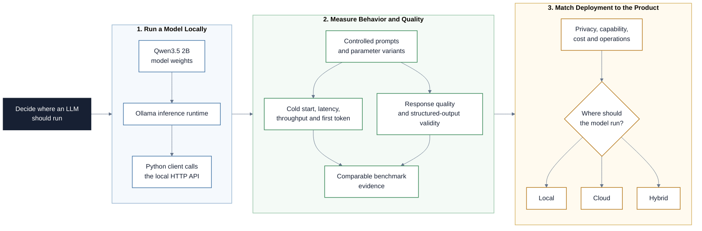

# Local Large Language Models

This repository introduces local language-model inference from an AI Product
Manager perspective. Participants run Qwen3.5 2B with Ollama, inspect the local
API boundary, measure operational behavior, and decide whether a local, cloud,
or hybrid deployment fits a product use case.

## Project at a Glance

The project runs a small model locally, measures its real behavior, and uses the
evidence to choose between local, cloud, and hybrid deployment.



## Learning Objectives

By the end of this repository, you should be able to:

- distinguish model weights, an inference runtime, an API, and an application;
- explain what local inference changes and what it does not guarantee;
- interpret model size, quantization, context, latency, and throughput;
- call an Ollama model from Python through an HTTP API;
- measure cold-start time, total response time, and generation throughput;
- compare prompt and temperature variants without confusing fluency with
  quality; and
- implement streaming responses and validate structured JSON output.

## Learning Path

The modules build on each other in order.

### Concepts and Runtime

| File | Description |
|---|---|
| [01 - Local LLM Foundations](01-local-llm-foundations.md) | Compare local and cloud inference, including privacy, control, capability, cost, and environmental trade-offs. |
| [02 - Running Local Models with Ollama](02-running-local-models-with-ollama.md) | Understand model variants, the Ollama runtime, API requests, parameters, and operational metrics. |

### Practical Integration

| File | Description |
|---|---|
| [03 - Local LLM Client](03-local-llm-client.py) | Send a prompt to Ollama and inspect the returned text and usage metrics. |
| [04 - Local LLM Evaluation](04-local-llm-evaluation.ipynb) | Run a small, reproducible evaluation of performance and behavior. |
| [05 - Streaming and Structured Output](05-streaming-and-structured-output.ipynb) | Measure time to first token and validate JSON responses against an expected schema. |

### Additional Folders and Files

| File / Folder | Description |
|---|---|
| [assets](assets/) | Locally stored and attributed visuals from official Ollama resources. |
| `pyproject.toml` | Python 3.13 project metadata and direct dependencies. |
| `uv.lock` | Reproducible dependency lock file. |

## Setup

### 1. Create the Repository from the Template

On GitHub, select **Use this template**, choose an owner and repository name,
leave **Include all branches** disabled, and select **Create repository**. For
pair or group work, only one person should create the repository.

### 2. Add Collaborators (Pairs/Groups Only)

Open the new repository's **Settings -> Collaborators** and add the other group
members.

### 3. Clone the Repository

Copy the SSH URL from the GitHub **Code** button, then run:

```bash
git clone <copied-ssh-url>
```

The URL will look similar to:

```text
git@github.com:<your-username>/<repo-name>.git
```

### 4. Install the Python Environment

Move into the project folder and synchronize the Python 3.13 environment:

```bash
cd <repo-name>
uv sync
```

`uv sync` installs the locked dependencies and creates `.venv/`.

### 5. Install Ollama and Download the Model

Choose the instructions for your operating system.

#### macOS

Ollama requires macOS 14 Sonoma or newer. Install it with
[Homebrew](https://brew.sh/):

```bash
brew install ollama
brew services start ollama
```

The first command installs the Ollama runtime and CLI. The second starts Ollama
as a background service and configures it to restart when you log in. See the
[Homebrew Ollama formula](https://formulae.brew.sh/formula/ollama) for current
platform support and package details.

#### Windows

Ollama requires Windows 10 22H2 or newer.

In **PowerShell**, run:

```powershell
irm https://ollama.com/install.ps1 | iex
```

In **Git Bash**, download and launch the native Windows installer:

```bash
curl -L https://ollama.com/download/OllamaSetup.exe -o OllamaSetup.exe
cmd.exe /c start "" OllamaSetup.exe
```

Complete the graphical installer, then close and reopen PowerShell or Git Bash
so the updated `PATH` is available. The application starts Ollama in the
background and makes the `ollama` command available in new terminal windows.
The installer can also be downloaded manually from the
[official Windows download page](https://ollama.com/download/windows).

#### Linux

Run the official installation script:

```bash
curl -fsSL https://ollama.com/install.sh | sh
```

The installer normally configures Ollama as a system service. If it is not
running, start it with:

```bash
sudo systemctl start ollama
```

For a foreground process on a system without `systemd`, run `ollama serve` and
leave that terminal open.

#### Verify the Installation

Open a new terminal and confirm that Ollama is available:

```bash
ollama --version
ollama list
```

Now download the course model:

```bash
ollama pull qwen3.5:2b
```

The Ollama library currently lists this model variant as a 2.7 GB download.
Available variants and sizes can change, so consult the
[official Qwen3.5 model page](https://ollama.com/library/qwen3.5/tags) when
planning storage and memory.

Verify the installation:

```bash
ollama run qwen3.5:2b
```

Enter `/bye` to leave the interactive session.

### 6. Run the Local LLM Client

Run file 3 through the Python environment managed by `uv`:

```bash
uv run python 03-local-llm-client.py
```

You can also supply your own prompt:

```bash
uv run python 03-local-llm-client.py "Explain one benefit of local inference."
```

The script displays a status message immediately, then prints the complete
response and its metrics. It intentionally waits for the complete response;
streaming is introduced in file 5.

The first request can be slower while Ollama loads the model. If the client
cannot connect or reaches its timeout, confirm the runtime and model state:

```bash
ollama list
ollama ps
```

Then run `ollama run qwen3.5:2b` once to verify the model independently before
retrying the Python client.

### 7. Open the Project

Open the repository in VS Code with `code .`. For the notebook, select the
Python environment created by `uv sync` as the kernel.

## References & Further Reading

- [Ollama Documentation](https://docs.ollama.com/)
- [Ollama API: Generate a Response](https://docs.ollama.com/api/generate)
- [Ollama Thinking](https://docs.ollama.com/capabilities/thinking)
- [Ollama API: Usage Metrics](https://docs.ollama.com/api/usage)
- [Ollama Model Library: Qwen3.5](https://ollama.com/library/qwen3.5)
- [Qwen Documentation](https://qwen.readthedocs.io/)
